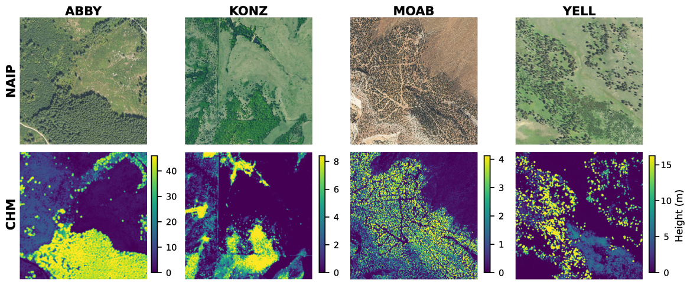
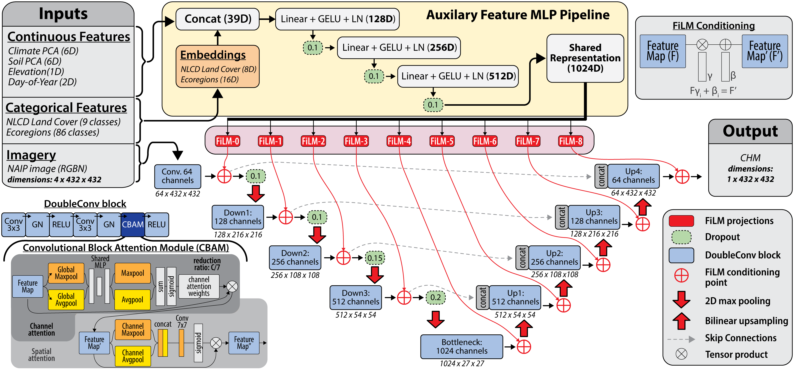

# NAIP-CHM: A 0.6-meter Resolution Canopy Height and Structure Model for the Contiguous United States

## Overview

This repository contains the source code, trained model weights, and inference tools for **NAIP-CHM**, a project that generates a 0.6-meter resolution canopy height and structure model (CHM) for the contiguous United States using National Agriculture Imagery Program (NAIP) aerial imagery.

**Explore the CONUS-wide product using our interactive Google Earth Engine App:**
https://naip-chm.projects.earthengine.app/view/naip-chm-a-conus-structure-model

The repository provides:
*   **Inference Pipeline:** Tools to generate canopy height models from NAIP DOQQs using a pre-trained U-Net model.
*   **Training Code:** Scripts to train the model on new data.
*   **Pre-trained Model:** Model weights used to generate the CONUS-wide dataset.
*   **Conditioning Data:** Static environmental raster data required for model inference.

## Example: Input (NAIP) & Output (CHM)



## Model Architecture



The NAIP-CHM model utilizes a U-Net architecture with approximately 22 million parameters, enhanced with attention mechanisms and multi-stage FiLM conditioning to integrate auxiliary environmental features. It processes 4-band NAIP imagery through an encoder-decoder structure while simultaneously processing environmental data (climate, soil, elevation) in a separate pathway. This design allows the model to effectively combine high-resolution visual data with broad-scale environmental context to generate precise canopy height estimations.

## Data Access

### 1. CONUS-wide CHM Product
This repository supports the generation of a CONUS-wide Canopy Height Model dataset (24.82 TB).

**Google Earth Engine:**
*   **Earth Engine Asset:** The dataset is available as an Earth Engine asset: `projects/naip-chm/assets/conus-structure-model`

**Direct Download (Free):**
The entire dataset is available for free download via HTTP.
*   **URL:** http://rangeland.ntsg.umt.edu/data/naip-chm/
*   **Documentation:** http://rangeland.ntsg.umt.edu/data/naip-chm/README

**Google Cloud Storage:**
Users working with the data in Google Cloud can also access the data via the requester pay bucket (`gs://naip-chm-assets`).
For detailed information, please refer to: `gs://naip-chm-assets/README`

### 2. Inference Assets
This repository includes the model weights, but static conditioning rasters must be downloaded separately to support local inference.

*   **Model Weights:** Located at `model/model_20251016.pt`
*   **Static Conditioning Rasters:** To support local inference, download the required environmental raster data by running:
    ```bash
    python scripts/download_conditioning_data.py
    ```
    This script will download the files to `data/conditioning_data/` and optionally download a sample NAIP DOQQ for testing.

### 3. Training Dataset
The training dataset is not included in this repository due to its size. It contains over 22 million image pairs.
You can download the training data from the University of Montana Rangeland server:
*   **URL:** http://rangeland.ntsg.umt.edu/data/rap/chm-naip/

## Installation

This codebase used **Python 3.11**.

1.  Ensure you have the repository files extracted to your local machine.

2.  Install the required dependencies:
    ```bash
    pip install -r requirements.txt
    ```

 ---

## Usage

### Google Colab (No-Code/Low-Code)
For users who prefer a no-code or low-code environment, we provide a Google Colab notebook to generate data:
*   **Notebook:** `notebooks/gee_inference_colab.ipynb`

### Running Inference
You can run the model on a standard NAIP DOQQ (Digital Ortho Quarter Quad) using the `scripts/inference.py` script. If you downloaded the sample NAIP image using `scripts/download_conditioning_data.py`, it will be located in `data/naip_doqqs/`.

**Example Command:**
```bash
python scripts/inference.py \
  --naip-quad data/naip_doqqs/m_3812259_nw_10_060_20220519.tif \
  --output-dir output/ \
  --model-checkpoint model/model_20251016.pt \
  --config configs/config.yaml \
  --static-rasters-dir data/conditioning_data/
```

**Arguments:**
*   `--naip-quad`: Path to the input 4-band NAIP imagery (R, G, B, NIR).
*   `--output-dir`: Directory where the output CHM GeoTIFF and report will be saved.
*   `--model-checkpoint`: Path to the model weights.
*   `--config`: Path to the configuration YAML file.
*   `--static-rasters-dir`: Directory containing the environmental conditioning rasters.
*   `--chip-size`: (Optional) Processing chip size (default: 432).
*   `--chip-overlap`: (Optional) Overlap between chips (default: 0.2).

### Training the Model
To train the model, you first need to generate the metadata Parquet file which includes extracted environmental features.

1.  **Generate Metadata:**
    Run the metadata generation script using the downloaded training dataset CSV and the static conditioning rasters.
    ```bash
    python scripts/create_metadata_parquet.py \
      --csv_path data/training_dataset/files.csv \
      --elevation_path data/conditioning_data/elevation.tif \
      --pca_path data/conditioning_data/climate_pca.tif \
      --soil_pca_path data/conditioning_data/soil_pca.tif \
      --output_path data/training_metadata/metadata.parquet
    ```
    *Note: Ensure `files.csv` is available from the downloaded training dataset.*

2.  **Run Training:**
    Use the `scripts/train.py` script. Ensure you have updated `configs/config.yaml` to point to the generated `metadata.parquet` and other data paths.

    **Command:**
    ```bash
    python scripts/train.py \
      --config configs/config.yaml \
      --experiment_name my_experiment
    ```

**Distributed Training:**
The script supports Distributed Data Parallel (DDP) training. To run on multiple GPUs (e.g., 2 GPUs):
```bash
torchrun --nproc_per_node=2 scripts/train.py \
  --config configs/config.yaml \
  --experiment_name my_ddp_experiment
```

---

## Citation

If you use this dataset or code in your research, please cite the following manuscript:

> Morford, S. L., Allred, B. W., Coons, S. P., Marcozzi, A. A., McCord, S. E., & Naugle, D. E. (XXXX). A 0.6-meter resolution canopy height model for the contiguous United States. *[Journal Name TBD]*.

The version-of-record repository for the manuscript can be found at Zenodo *[URL]*

---

## License

This project is licensed under the MIT License. See the [LICENSE](LICENSE) file for details.
